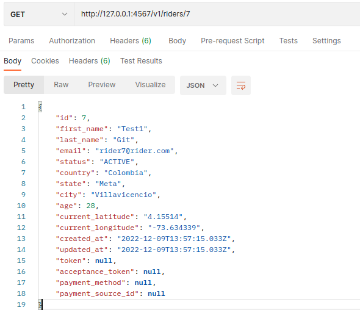
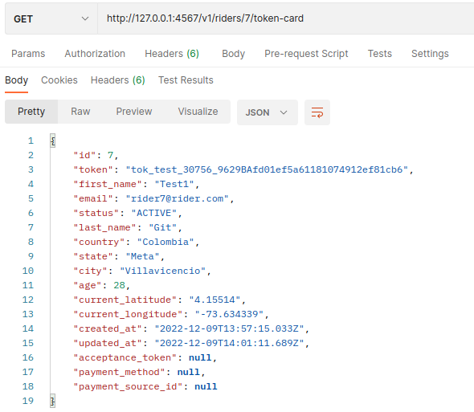
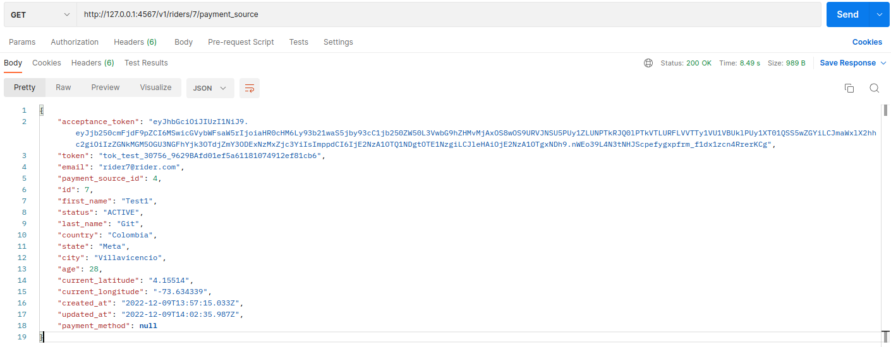
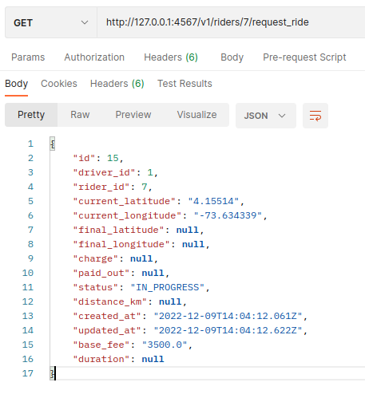
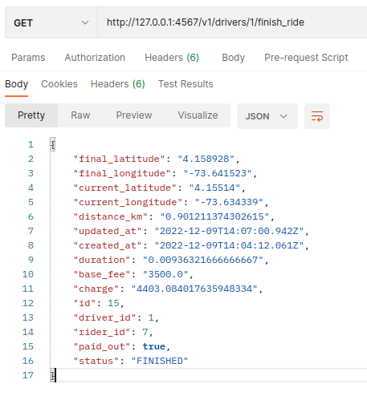
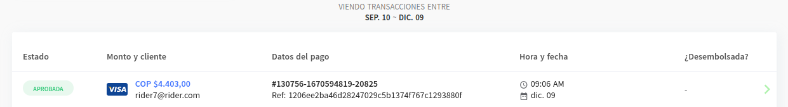

#Test Api#

## Endpoints ##
### v1/ ###
#### GET ####
* v1/drivers - Returns a list of drivers
* v1/drivers/:id - Return an individual driver
* v1/riders - Returns a list of riders
* v1/riders/:id - Return an individual rider
* v1/riders/:id/token-card - Return a token card for a rider
* /v1/riders/:id/payment_source - Return a payment source for a rider
* /v1/riders/:id/request_ride - A Raider can request a ride
* /v1/drivers/:id/finish_ride - A driver can finish a ride

### Flow ###
* Rider (id:7) (The raider has'nt a payment source)

* Rider (id:7) Request a token card

* Rider (id:7) Request a payment source (Now the raider has a payment source and a acceptance token)

* Rider (id:7) Request a ride (The program asign a free driver to the rider. Is there not a free driver, indicates an error. The ride start at rider position)

* Driver (id:1) Finish the ride (The driver finish the ride and the program calculate the price of the ride)

* The transaction is generated and paid in Api.

