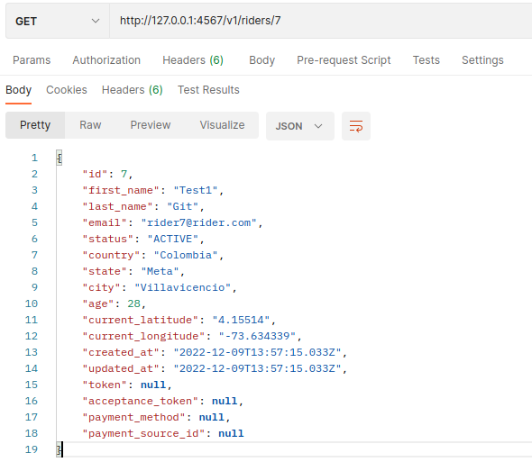
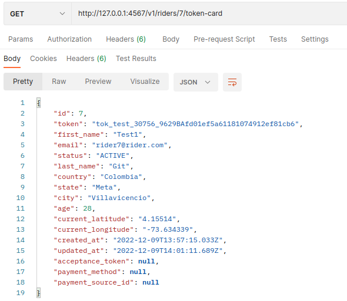
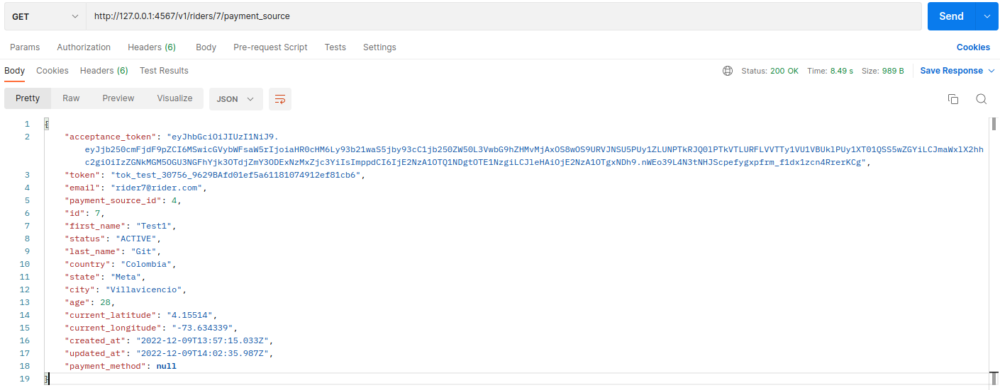
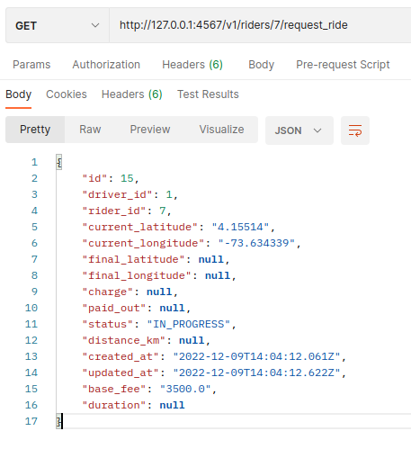
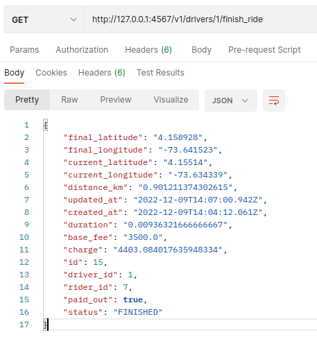
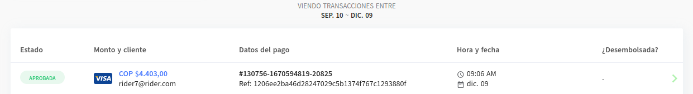

## Considerations ##
* This is a Sinatra app, so you can run it with `ruby app.rb` or with docker as described below.
* It is *not necessary* to configure the postgres database. It is already hosted on a remote server.
* Below you can see an example of a flow that you can follow to test the app. You can use raider id:8 and id:9 to test if you want.

## Run and Enjoy ##
* You can run the app with docker. Just run `docker-compose up` and it will be available on `localhost:4567`.
* You can also run it with `ruby app.rb` and it will be available on `localhost:4567`:
    * `bundle install`
    * `ruby app.rb`
  
## Test ##
* You can test the app with command $ `bundle exec rspec`
* You should have 14 tests and 0 errors (I hope)
## Endpoints ##
### v1/ ###
#### GET ####
* v1/drivers - Returns a list of drivers
* v1/drivers/:id - Return an individual driver
* v1/riders - Returns a list of riders
* v1/riders/:id - Return an individual rider
* v1/riders/:id/token-card - Return a token card for a rider
* /v1/riders/:id/payment_source - Return a payment source for a rider
* /v1/riders/:id/request_ride - A Raider can request a ride
* /v1/drivers/:id/finish_ride - A driver can finish a ride

### Flow ###
* Rider (id:7) (The raider has'nt a payment source)

* Rider (id:7) Request a token card

* Rider (id:7) Request a payment source (Now the raider has a payment source and a acceptance token)

* Rider (id:7) Request a ride (The program assign a free driver to the rider. Is there not a free driver, indicates an error. The ride start at rider position)

* Driver (id:1) Finish the ride (The driver finish the ride and the program calculate the price of the ride)

* The transaction is generated and paid in Api.

## David Santiago Mesa Martínez. ##
### davidmesa02@gmail.com ###
### +57 310 576 5718 #### challenge
